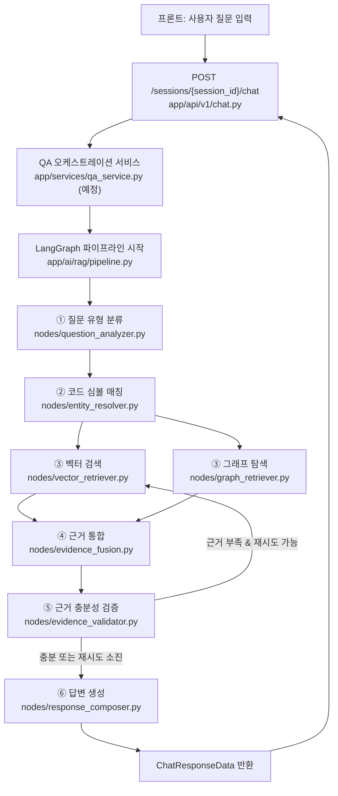

# RepoMind LangGraph 질의응답 파이프라인 설계 문서

> 이 문서는 아직 구현하지 않은 LangGraph 파이프라인의 설계를 기록해둔 문서다.
> 목적은 두 가지: (1) 팀 참고용, (2) Claude가 다음 세션에서 이 대화 맥락 없이
> 다시 작업할 때 처음부터 다시 조사하지 않아도 되게 하는 것. 그래서 "당연히
> 알겠지" 싶은 것도 최대한 풀어서 적었다.

## 0. 지금 이 문서를 왜 만들었는가

Java 파서 → 그래프 매핑(Neo4j) → 청킹/임베딩(pgvector)까지
구현을 마쳤고, DB 연동(마이그레이션, 스키마, extension 권한 이슈 등)도 해결한
뒤 다음 단계로 LangGraph 기반 질의응답 파이프라인 설계에 들어가려는 시점에
작성됨. **아직 파이프라인 로직은 구현하지 않았고, 파일 구조와 각 파일의
책임만 스텁(skeleton)으로 만들어둔 상태**다.

---

## 1. 전체 프로세스 흐름



질문 예시: "로그인 프로세스 흐름을 알려줘", "왜 논리 삭제로 구현했어?" 같은
자연어 질문이 세션(대화방) 안에서 들어오고, 답변은 요약/근거/확실성/그래프
시각화 데이터를 포함한 구조화된 형태로 나간다.

---

## 2. 이미 구축되어 있는 인프라 (파이프라인이 그대로 갖다 쓸 것들)

이 섹션이 중요한 이유: 파이프라인을 짤 때 이미 있는 걸 다시 만들지 않기
위해서다.

### 2.1 pgvector — 코드 청크 벡터 검색

- 테이블: `code_chunks` (마이그레이션 `migrations/versions/20260816_01_create_code_chunks.py`)
- 모델: `app/models/code_chunk.py`
- 컬럼: `graph_node_id`(Neo4j MethodVersion key와 동일), `method_node_id`
  (논리 Method key), `content_hash`, `github_repository_id`, `commit_hash`,
  `text`, `embedding vector(1536)`, `path`, `class_name`,
  `method_name`, `layer`, `api_http_method`, `api_path` 등
- 저장 로직: `app/repositories/code_chunk.py`(`CodeChunkRepository.upsert_chunks`),
  오케스트레이션: `app/services/chunk_import.py`(`ChunkImportService`),
  실행: `scripts/import_chunks.py`
- **아직 없는 것: 검색(조회) 로직.** 지금까지 만든 건 전부 "저장"만 하고, 질문
  임베딩으로 유사도 검색하는 코드(`SELECT ... ORDER BY embedding <=> :query`)는
  아직 없음. `Vector Retriever` 노드를 만들 때 `CodeChunkRepository`에
  `search_similar(query_embedding, github_repository_id, top_k)` 같은 메서드를
  추가해야 함.
- 상태(2026-08-16 기준): pgvector `CREATE EXTENSION`이 team2db에서
  `azure_pg_admin` 권한 필요로 막혀 있어서, 실제 데이터 적재는 관리자 조치
  대기 중. 코드 자체는 완성.

### 2.2 Neo4j — 코드 구조 그래프

- 노드/엣지 변환: `app/graph/mappings.py`
  (`map_java_file`, `resolve_cross_file_references`; `app/graph/identifiers.py`의
  `class_key`/`method_key`/`constructor_key`를 chunking.py와 공유)
- 저장: `app/graph/repositories/code_graph.py`(`CodeGraphRepository.save`)
- 오케스트레이션: `app/services/code_graph_import.py`(`CodeGraphImportService`)
- 실행: `scripts/import_code_graph.py --github-repository-id ID --repository-path PATH --commit-hash SHA [--skip-repository-validation]`
- 노드 타입: `File`, `Package`, `Class`, `Interface`, `Method`, `MethodVersion`, `Endpoint`
- Method는 논리 식별자이며 소스가 변경된 경우에만 content hash 기반
  MethodVersion을 추가함
- 엣지 타입: `DECLARES`, `CONTAINS`, `HAS_VERSION`, `INTRODUCED_IN`, `DELETED_IN`,
  `CALLS`, `EXTENDS`, `IMPLEMENTS`, `IMPORTS`, `MANAGES`, `EXPOSES`
- CALLS는 `(MethodVersion)-[:CALLS]->(Method)` 형태로 특정 코드 버전의 호출을 표현함
- **아직 없는 것: 조회(탐색) 로직.** Cypher로 "이 노드에서 CALLS를 N단계
  따라가기" 같은 쿼리 함수가 아직 없음. `Graph Retriever` 노드에서 새로
  작성해야 함.

### 2.3 GitHub 이력 그래프 (Neo4j, 같은 DB 안의 다른 노드 타입들)

- `app/graph/mappers/github.py`, `app/graph/repositories/github_history.py`
- 노드: `Repository`, `Branch`, `Issue`, `PullRequest`, `Commit`, `File`(코드
  그래프와 **같은 File 노드 공유**, key 형식이 동일: `{repo_id}:file:{path}`),
  `Developer`
- 엣지: `HAS_BRANCH`, `HAS_ISSUE`, `HAS_PULL_REQUEST`, `HAS_COMMIT`, `HAS_FILE`,
  `POINTS_TO`, `CONTAINS_COMMIT`, `CHANGED`(Commit→File, PR→File),
  `RESOLVES`/`REFERENCES`(PR→Issue), `PARENT`(Commit→Commit), `AUTHORED`
- **중요한 빈틈**: `Commit -[:CHANGED]-> File`까지는 있지만
  `Symbol/Method -[:CHANGED_BY]-> Commit` 관계는 아직 없음(메서드 단위
  변경 이력 연결 안 됨). PostgreSQL `commit_file_change_hunks` 테이블에
  정확한 변경 줄 범위(`new_start_line`, `new_line_count`)가 있으니, 이걸
  Method 노드의 `start_line`/`end_line`과 겹침 비교해서 `CHANGED_BY` 엣지를
  만드는 배치 작업이 필요함(개발 의도 질문에 이 관계가 핵심적으로 쓰임).
  **이건 이 파이프라인 설계 범위 밖의 별도 작업이지만, Graph Retriever가
  이 관계에 의존하게 될 것이므로 미리 적어둠.**

### 2.4 임베딩 / LLM 호출

- `app/services/embedding.py`(`EmbeddingService.embed(str | list[str])`) — 이미
  완성, 배치 지원.
- LLM(답변 생성/질문 분류) 채팅 호출용 서비스는 **아직 없음**. `.env`에
  `AZURE_OPENAI_DEPLOYMENT=team-2-gpt54mini`,
  `AZURE_OPENAI_NANO_DEPLOYMENT=shared-gpt54nano`가 있는 걸 보면 채팅 모델
  배포는 이미 있음 — `EmbeddingService`와 비슷한 패턴으로
  `ChatCompletionService` 같은 걸 새로 만들어야 함(질문 분류는 가벼운 nano
  모델, 답변 생성은 mini 모델을 쓰는 방향이 비용상 합리적일 듯).

### 2.5 API/DTO 레이어 (프론트와 이미 계약이 정해져 있음)

- `POST /sessions/<session_id>/chat` — `app/api/v1/chat.py`
- 요청: `ChatRequest(question, question_kind)` (`app/dtos/chat.py`)
  - `question_kind: Literal["intent", "impact", "location", "flow"] | None`
    — **질문 유형이 4가지**(구조/흐름/개발의도 3가지로 알고 있었다면 갱신
    필요 — `impact`(영향 범위 분석)가 추가로 있음)
- 응답: `ChatResponseData` — `summary`, `claims: list[Claim]`,
  `evidence: list[Evidence]`, `confidence: Confidence`, `graph: GraphData`,
  `uncertainties`, `suggestedQuestions`
  - `Claim.kind: Literal["fact", "stated_intent", "inference"]` — 이게 바로
    "확인된 사실 / 명시된 의도 / 추론된 의도" 3단계 구분임(프로젝트 핵심 원칙이
    이미 타입 레벨로 반영돼 있음)
  - `Evidence.type: Literal["code", "itsm", "commit"]`
- 지금은 `app/sample/mock_chat.py`의 `get_mock_chat_response()`가 하드코딩된
  더미 데이터를 반환 중. `app/api/v1/chat.py` 30번째 줄에 명시적으로
  `# TODO: 실제 RAG 파이프라인 연동 시 아래 목(Mock) 데이터를 삭제하고
실제 생성 로직으로 교체` 주석이 있음 — **이 자리가 Response Composer의
  최종 출력이 꽂힐 지점.**
- 세션 관리(`app/api/v1/sessions.py`, `app/repositories/memory_store.py`)도
  전부 인메모리 mock 상태. `SessionCreateRequest.repo_id: str`가 어떤
  저장소인지 가리키는데, 이게 `Repository`(Postgres, uuid) 행인지
  `github_repository_id`(int)인지 아직 실제로 연결 안 돼 있음 — **파이프라인이
  세션→레포 매핑을 실제로 어떻게 가져올지는 미해결 이슈**(4번 섹션 참고).

---

## 3. 새로 만들 파일 구조 (설계만, 아직 로직 없음)

```
app/
  ai/
    __init__.py
    rag/
      __init__.py
      state.py                 # QAState 공유 상태 스키마
      pipeline.py               # LangGraph StateGraph 조립 + 컴파일 + 실행 진입점
      nodes/
        __init__.py
        question_analyzer.py    # ① 질문 유형 분류
        entity_resolver.py      # ② 코드 심볼 매칭
        vector_retriever.py     # ③ 벡터 검색 (pgvector)
        graph_retriever.py      # ③ 그래프 탐색 (Neo4j)
        evidence_fusion.py      # ④ 근거 통합
        evidence_validator.py   # ⑤ 근거 충분성 검증 (조건부 루프의 분기점)
        response_composer.py    # ⑥ 답변 생성 (ChatResponseData로 변환)
    generation/
      __init__.py
      prompts.py                 # 질문 분류/답변 생성 프롬프트 템플릿 모음
  services/
    qa_service.py                 # app/api/v1/chat.py가 호출할 오케스트레이션 서비스
                                   # (app/services/code_graph_import.py와 같은 패턴:
                                   #  요청 받기 -> 파이프라인 실행 -> DTO로 변환해 반환)
```

파일별 상세는 아래 4번, 각 파일 안의 docstring에도 동일한 내용이 있음(중복
기록 — 코드만 봐도 이 문서 내용이 재구성되게 하기 위함).

---

## 4. 파일별 상세 설계

### 4.1 `app/ai/rag/state.py` — 공유 State 스키마

LangGraph의 각 노드는 이 State를 입력받아 일부를 채워서 반환한다. 필드는
아래와 같이 설계함(실제 타입은 파일 안에서 `TypedDict`로 정의):

| 필드                             | 타입                     | 채우는 노드        | 설명                                                                                                                          |
| -------------------------------- | ------------------------ | ------------------ | ----------------------------------------------------------------------------------------------------------------------------- |
| `question`                       | str                      | (입력)             | 사용자 원본 질문                                                                                                              |
| `question_kind`                  | str \| None              | (입력 or Analyzer) | `intent`/`impact`/`location`/`flow`. 프론트가 이미 넘겨줄 수도 있음(`ChatRequest.question_kind`) — 있으면 분류 단계 스킵 가능 |
| `github_repository_id`           | int                      | (입력)             | 세션→레포 매핑에서 가져옴                                                                                                     |
| `conversation_id` / `session_id` | str \| None              | (입력)             | 후속 질문 맥락용                                                                                                              |
| `entity_candidates`              | list[dict]               | Entity Resolver    | 매칭된 심볼 후보 (name, type, graph_node_id, confidence)                                                                      |
| `vector_results`                 | list[dict]               | Vector Retriever   | pgvector 검색 결과 (text, similarity, graph_node_id, metadata)                                                                |
| `graph_results`                  | dict                     | Graph Retriever    | Neo4j 탐색 결과 (nodes, edges — `app/dtos/chat.py`의 `GraphData`와 최종적으로 호환되게)                                       |
| `evidence`                       | list[dict]               | Evidence Fusion    | 통합된 근거 (type: code/itsm/commit, content, source)                                                                         |
| `is_sufficient`                  | bool                     | Evidence Validator | 근거 충분 여부                                                                                                                |
| `retry_count`                    | int                      | Evidence Validator | 무한 루프 방지용 (최대 재시도 횟수 도달하면 강제로 답변 생성 단계로)                                                          |
| `answer`                         | ChatResponseData \| None | Response Composer  | 최종 출력                                                                                                                     |

**설계 원칙**: `graph_results`/`evidence`/`answer`는 최종적으로
`app/dtos/chat.py`의 `GraphData`/`Evidence`/`ChatResponseData`와 필드가
호환되도록 맞춘다 — 파이프라인 결과를 API 응답으로 바꿀 때 변환 로직을
최소화하기 위함.

### 4.2 `app/ai/rag/pipeline.py` — 그래프 조립

- `build_graph() -> CompiledGraph`: 7개 노드를 `add_node`로 등록하고,
  `add_edge`로 순서를 잇고, Evidence Validator 이후에는
  `add_conditional_edges`로 "근거 부족 & retry_count < MAX → Vector/Graph
  Retriever로 복귀", "충분 또는 재시도 소진 → Response Composer" 분기를 만듦.
- `run_qa_pipeline(question, github_repository_id, ...) -> ChatResponseData`:
  초기 State를 만들고 컴파일된 그래프를 실행해서 최종 답변을 꺼내는
  진입점. `app/services/qa_service.py`가 이걸 호출함.
- `MAX_RETRIES` 상수로 루프 상한을 둠(예: 2).

### 4.3 `app/ai/rag/nodes/question_analyzer.py`

- 입력: `state.question`, (있으면) `state.question_kind`
- 이미 `question_kind`가 프론트에서 넘어왔으면 이 노드는 스킵하거나
  검증만 해도 됨. 없으면 LLM(가벼운 nano 모델 추천)으로 4가지 중 분류.
- 출력: `state.question_kind` 채움

### 4.4 `app/ai/rag/nodes/entity_resolver.py`

- 입력: `state.question`
- 질문 속 도메인 용어를 코드 심볼 이름 후보와 매칭(문자열 부분일치 우선,
  필요하면 심볼명 임베딩 유사도 보강). Neo4j에서 심볼 이름 목록을
  조회하거나, 별도 캐시/인덱스를 둘지는 구현 시점에 결정 필요(미해결 이슈).
- 출력: `state.entity_candidates`
- **우선순위 참고**: 이전 대화에서 결론 낸 바로는, 실제 시작점 발견은
  Vector Retriever가 `graph_node_id`를 통해 더 안정적으로 해주기 때문에
  Entity Resolver는 "보강/정밀도 향상용"으로 후순위로 미뤄도 MVP에 큰 지장
  없음. 시간 없으면 이 노드부터 빼고 처음엔 Vector Retriever 결과만으로
  Graph Retriever를 태워도 됨.

### 4.5 `app/ai/rag/nodes/vector_retriever.py`

- 입력: `state.question`, `state.github_repository_id`
- `EmbeddingService.embed(question)` → `CodeChunkRepository`에 코사인 유사도
  검색 메서드(신규 작성 필요, 2.1 참고)로 top-k 조회
- 출력: `state.vector_results` (각 결과에 `graph_node_id` 포함 — 다음 단계
  Graph Retriever의 시작점이 됨)

### 4.6 `app/ai/rag/nodes/graph_retriever.py`

- 입력: `state.vector_results`(의 `graph_node_id`들), `state.entity_candidates`,
  `state.question_kind`
- `question_kind`에 따라 탐색 관계를 다르게(신규 Cypher 쿼리 작성 필요):
  - `flow`: `CALLS` 관계를 depth N까지
  - `intent`: `CHANGED_BY`(아직 없음, 2.3 참고) → `Commit` →
    `REFERENCES`/`RESOLVES` → `Issue`
  - `impact`: `CALLS`의 역방향(누가 이 메서드를 호출하는지)
  - `location`: 얕은 depth 1~2 정도만
- 출력: `state.graph_results`

### 4.7 `app/ai/rag/nodes/evidence_fusion.py`

- 입력: `state.vector_results`, `state.graph_results`
- 중복 제거, 관련도 재정렬, `Evidence` DTO 형태로 정리
- 출력: `state.evidence`

### 4.8 `app/ai/rag/nodes/evidence_validator.py`

- 입력: `state.evidence`, `state.question`
- 근거로 답변 가능한지 판단(휴리스틱으로 시작 — 예: evidence 개수 0이면
  무조건 부족, 나중에 LLM 판단으로 고도화 가능)
- 출력: `state.is_sufficient`, `state.retry_count` 증가
- 이 노드가 `pipeline.py`의 조건부 엣지 분기 기준이 됨

### 4.9 `app/ai/rag/nodes/response_composer.py`

- 입력: `state.evidence`, `state.question`, `state.question_kind`
- LLM 호출(mini 모델)로 "확인된 사실/명시된 의도/추론된 의도" 구분 프롬프트
  실행 → `Claim`, `Evidence`, `Confidence`, `GraphData` 채워서
  `ChatResponseData` 조립
- 출력: `state.answer` (`ChatResponseData` 인스턴스)
- **이 노드의 출력 형태가 `app/sample/mock_chat.py`의 반환값과 완전히
  같아야 함** — 그래야 `app/api/v1/chat.py`에서 mock 호출 한 줄만 실제
  호출로 바꿔치기하면 끝남.

### 4.10 `app/ai/generation/prompts.py`

- 질문 분류 프롬프트, 답변 생성 프롬프트(사실/명시된 의도/추론 구분 지시
  포함) 템플릿 문자열들을 모아두는 곳. 노드 파일들은 여기서 import해서 씀
  (프롬프트 튜닝할 때 로직 코드 안 건드리고 여기만 고치면 되게).

### 4.11 `app/services/qa_service.py`

- `app/api/v1/chat.py`가 호출할 진입점. `CodeGraphImportService` 패턴과
  동일하게: 요청(`ChatRequest` + `session_id`) 받기 → 세션에서
  `github_repository_id` 조회(미해결 이슈, 4.1 참고) →
  `run_qa_pipeline()` 호출 → `ChatResponseData` 반환.
- `app/api/v1/chat.py`의 TODO 자리에 이 서비스 호출로 교체하면 mock 제거 완료.

---

## 5. 구현 순서 제안 (2026-08-16 대화에서 합의한 순서)

1. `state.py` — State 스키마 확정
2. `pipeline.py` 스켈레톤 — 노드 전부 더미(pass-through)로 넣고 조건부 루프
   포함해서 컴파일·실행이 되는지부터 검증
3. `vector_retriever.py` 실제 구현 — pgvector 확장 활성화되는 대로 바로 테스트
   가능(데이터도 이미 넣어놓음)
4. `graph_retriever.py` 실제 구현 — Neo4j 연동 확인되는 대로 테스트 가능
5. `question_analyzer.py` — 독립적이라 아무 때나 가능, 가장 단순
6. `entity_resolver.py`, `evidence_fusion.py`, `evidence_validator.py`,
   `response_composer.py` — 3~4번 결과가 있어야 의미 있게 테스트 가능하므로 후순위

---

## 6. 미해결 이슈 (다음에 결정해야 할 것들)

1. **세션 ↔ 레포 매핑**: `SessionCreateRequest.repo_id`가 실제로 무엇을
   가리키는지(Postgres `repositories.id` UUID? `github_repository_id`?)
   정해지지 않음. `qa_service.py`가 여기서 `github_repository_id`를 뽑아내야
   하는데 지금 세션 저장소가 인메모리 mock이라 실제 연결 로직이 없음.
2. **Method 단위 변경 이력(`CHANGED_BY`) 그래프 엣지**: 아직 생성 로직 없음
   (2.3 참고). `intent`/`impact` 질문 유형에 필요.
3. **pgvector 검색 메서드**: `CodeChunkRepository`에 유사도 검색 메서드 없음(2.1).
4. **Neo4j 그래프 탐색 Cypher 쿼리들**: 아직 하나도 작성 안 됨(2.2, 4.6).
5. **채팅용 LLM 호출 서비스**: `EmbeddingService`에 대응하는 `ChatCompletionService`
   같은 게 없음(2.4).
6. **pgvector `CREATE EXTENSION` 권한**: `team2db`에서 `azure_pg_admin` 필요,
   관리자 조치 대기 중(2.1 상태 참고). 이게 풀려야 실 데이터로 벡터 검색
   테스트 가능.
7. **Entity Resolver의 심볼 이름 조회 방식**: Neo4j 직접 쿼리 vs 별도
   캐시/인덱스 — 미정.
